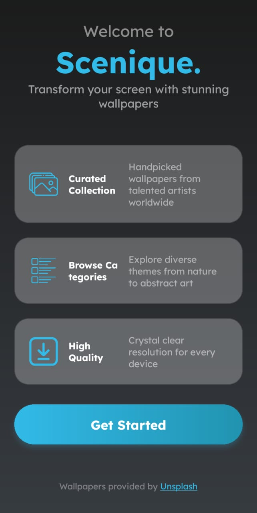
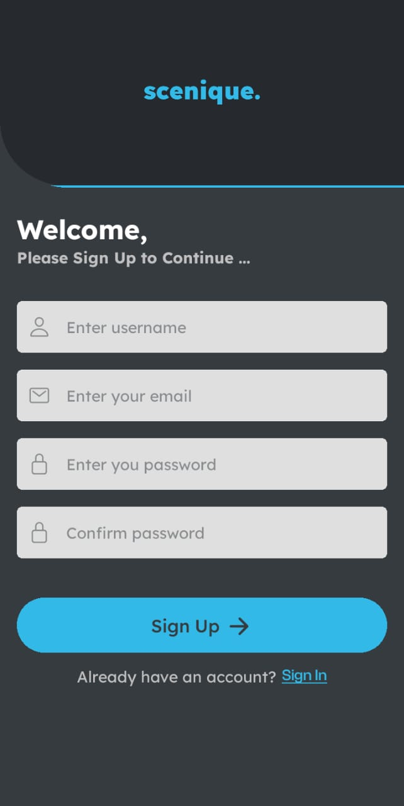
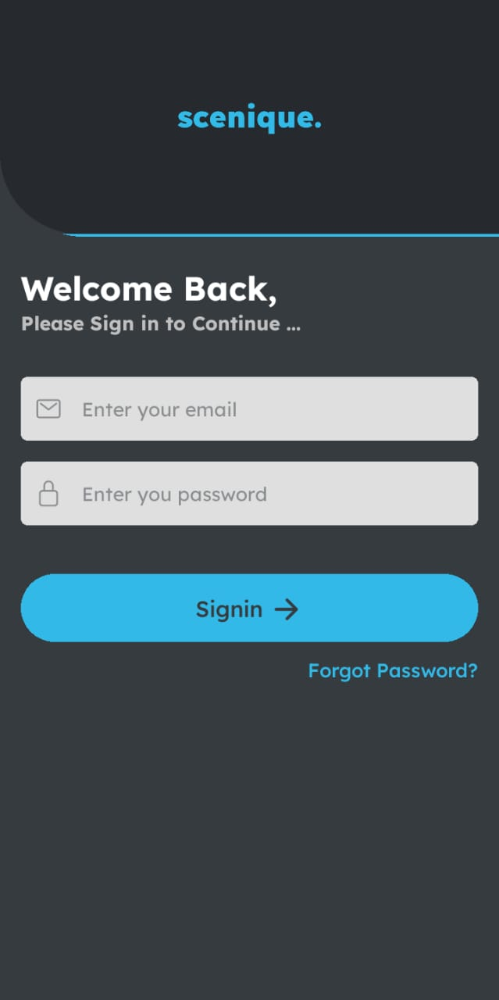
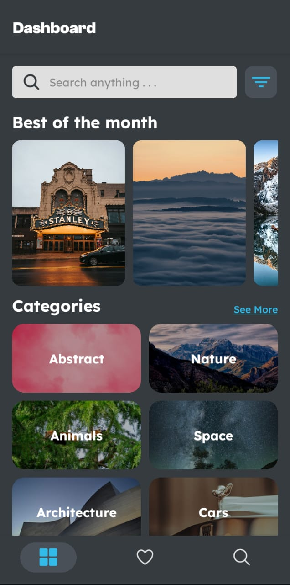
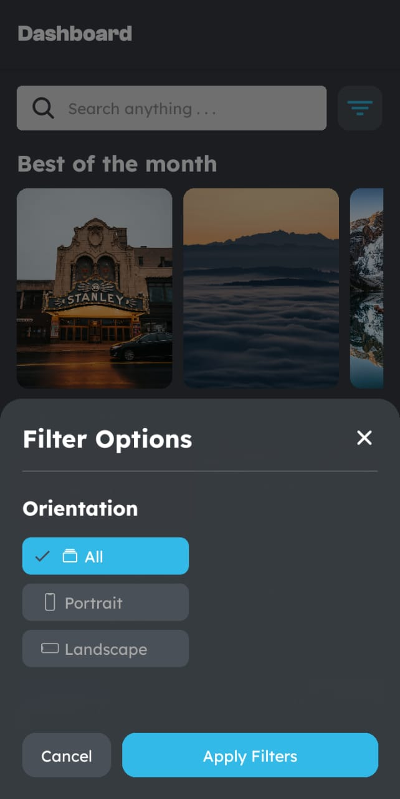
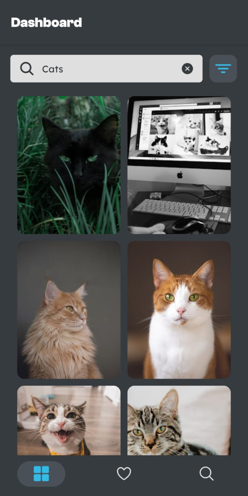
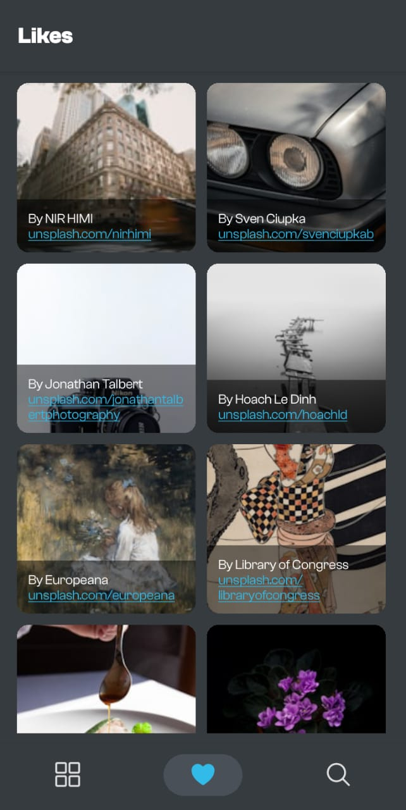
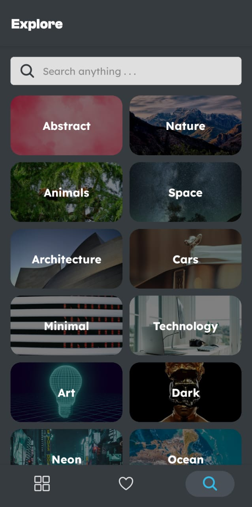
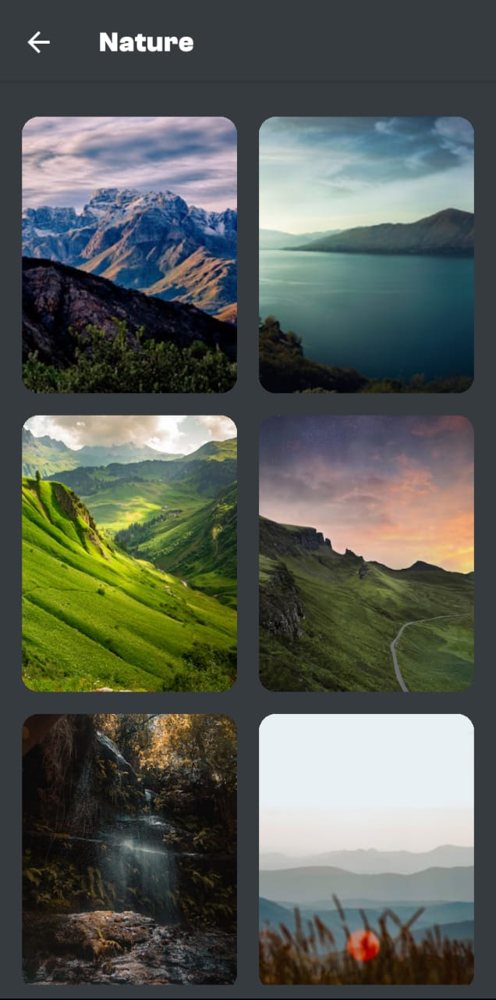
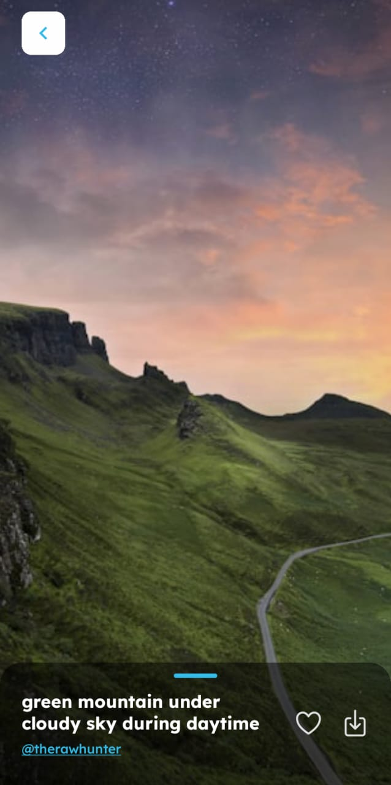

# Scenique - Wallpaper App

**Scenique** is a beautiful wallpaper app built using **React Native Expo CLI** and **TypeScript**, designed to help users browse, search, and download high-quality wallpapers from **Unsplash**. With a user-friendly interface, smooth animations, and seamless navigation, Scenique delivers a delightful experience for wallpaper lovers.

Built for **notJustHack 2024** by **notJust.dev**, Scenique aims to showcase high-performance mobile app development using modern tools and technologies.

## Features

- **Search and Browse**: Discover and explore a wide variety of high-quality wallpapers from the Unsplash API.
- **Download Wallpapers**: Save your favorite wallpapers directly to your device for offline access.
- **User-friendly Interface**: Simple navigation and intuitive design for a smooth user experience.
- **Beautiful Animations**: Engaging animations powered by Lottie and Reanimated for a modern touch.

## Screenshots

Here’s a preview of what Scenique looks like:

<div style="flex-direction: row; gap: 10px;">
  
  
  
  
  
  
  
  
  
  
</div>

## Installation

To get started with **Scenique**, follow these simple steps:

### 1. Clone the repository

```bash
git clone https://github.com/yourusername/scenique.git
```
### 2. Install dependencies

Navigate to the project directory and install the required packages:

```bash
npm install
```
### 3. Run the app
Start the development server with Expo:

```bash
npx expo start
or
npm start
```
Follow the instructions provided by Expo to open the app on your emulator or a physical device.

## Dependencies

Scenique uses the following key dependencies to enhance functionality and performance:

- **@expo/vector-icons**: A collection of customizable icons for the app's UI.
- **@react-native-async-storage/async-storage**: Stores user preferences and settings locally for a personalized experience.
- **@react-navigation/bottom-tabs, @react-navigation/native, @react-navigation/native-stack**: Handles smooth navigation with bottom tabs and stack-based routing.
- **axios**: A promise-based HTTP client for fetching wallpaper data from the Unsplash API.
- **expo**: The core Expo SDK used to build and deploy the app on both Android and iOS platforms.
- **expo-blur**: Adds visual blur effects for UI elements, enhancing the app's aesthetic appeal.
- **expo-file-system**: Allows downloading and saving wallpapers to the device's file system.
- **expo-font**: Used to load custom fonts to improve typography across the app.
- **expo-linear-gradient**: Enables gradient backgrounds and smooth color transitions for a modern design.
- **expo-media-library**: Manages photos and videos on the device for saving and organizing wallpapers.
- **expo-status-bar**: Customizes the status bar appearance for a more polished look.
- **firebase**: Provides user authentication and data management services to save favorite wallpapers and preferences.
- **react-native-gesture-handler**: Implements gestures such as swipes, taps, and long presses for better user interactions.
- **react-native-paper**: A library of Material Design components, ensuring consistent design patterns throughout the app.
- **react-native-reanimated**: Used for complex and performant animations, giving the app a smooth and responsive feel.
- **react-native-safe-area-context**: Ensures the app UI is properly aligned within the safe areas of devices, avoiding obstructions like notches or edge displays.
- **react-native-screens**: Optimizes navigation by using native screens for better performance.
- **react-native-toast-message**: Displays toast notifications for feedback on user actions (e.g., wallpaper saved or downloaded).

## Acknowledgements

We would like to extend our heartfelt thanks to the following:

- **Unsplash**: For providing a vast collection of high-quality, royalty-free images through their API, which serves as the core of the app's functionality.
- **Expo**: For their powerful platform that simplifies React Native app development and deployment, allowing us to focus on building a great app.
- **React Native Community**: For building and maintaining the open-source libraries and tools that make React Native such a powerful framework.
- **notJust.dev**: For their continuous support in making this project a reality and for fostering a great learning environment during notJustHack 2024.
